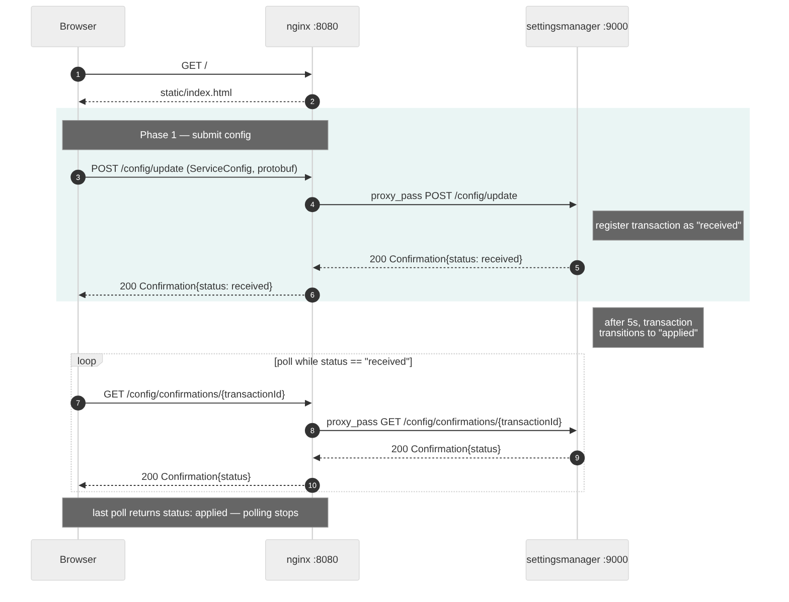

# settingsmanager-ngnix

Statische Seite (nginx) mit Formular für eine `ServiceConfig`, die
als Protobuf-Binärnachricht per Reverse Proxy an einen lokalen
Go-Service weitergeleitet wird.

## Architektur

```
Browser  --GET /----------------------------------> nginx :8080 --> static/index.html
Browser  --POST /config/update---------------------> nginx :8080 --> settingsmanager :9000/config/update
Browser  --GET /config/confirmations/{transactionId}> nginx :8080 --> settingsmanager :9000/config/confirmations/{transactionId}
```

Sämtliche Nutzdaten sind Protobuf-Nachrichten aus
[`proto/messages.proto`](proto/messages.proto): der Browser
schickt eine `modbus_messages.ServiceConfig` (mit einer `modbus_messages.ModbusConfig` im
`details`-Feld, gepackt als `google.protobuf.Any`) binär an
`/config/update`. Der `settingsmanager`-Service registriert die
Transaktion und antwortet sofort mit einer
`modbus_messages.Confirmation{status: received}`. Der Browser
dekodiert die Antwort mit
[protobuf.js](https://github.com/protobufjs/protobuf.js), das die
`.proto`-Datei zur Laufzeit über `/proto/messages.proto` lädt, und
pollt danach im Sekundentakt `/config/confirmations/{transactionId}`,
bis `settingsmanager` den Status nach 5 Sekunden intern auf
`applied` gesetzt hat.

Sequenzdiagramm des Ablaufs:



## Protobuf-Typen neu generieren

Nach Änderungen an `proto/messages.proto`:

```
cd proto
protoc --proto_path=. --proto_path=<protobuf-include-dir> \
  --go_out=. --go_opt=module=settingsmanager-ngnix/proto messages.proto
```

`<protobuf-include-dir>` ist der `include`-Ordner der
protobuf-Installation, der die Well-known-Types wie
`google/protobuf/any.proto` enthält:

- macOS: `brew install protobuf` (Include-Ordner z. B. via
  `brew --prefix protobuf`)
- Arch/Omarchy: `sudo pacman -S protobuf` (Include-Ordner
  `/usr/include`)

Voraussetzung ist außerdem `protoc-gen-go`:

```
go install google.golang.org/protobuf/cmd/protoc-gen-go@latest
```

(landet in `$(go env GOPATH)/bin`, muss im `PATH` liegen)

## Voraussetzungen

- nginx
  - macOS: `brew install nginx`
  - Arch/Omarchy: `sudo pacman -S nginx`
- Go >= 1.26

## Starten

1. Settingsmanager-Service starten:

   ```
   cd settingsmanager && go run main.go
   ```

   Lauscht auf `127.0.0.1:9000`.

2. nginx mit der Projekt-Config starten:

   ```
   mkdir -p logs/tmp
   nginx -p $(pwd) -c nginx/nginx.conf
   ```

   Lauscht auf `127.0.0.1:8080`. `logs/tmp` muss vorher existieren,
   da `nginx.conf` dort projektlokale Temp-Verzeichnisse anlegt
   (Distro-Pakete wie unter Arch/Omarchy verwenden sonst
   `/var/lib/nginx` bzw. `/var/log/nginx`, die ohne root nicht
   beschreibbar sind).

3. Seite öffnen: http://127.0.0.1:8080

   JSON-Eingabe im Textfeld anpassen und "Senden" klicken. Die
   Seite wandelt die Eingabe im Browser in eine
   `modbus_messages.ServiceConfig`-Protobuf-Nachricht um, schickt sie binär und
   zeigt die dekodierte `Confirmation`-Antwort direkt darunter an.

## Stoppen

```
nginx -p $(pwd) -c nginx/nginx.conf -s stop
```

Settingsmanager mit Ctrl-C beenden.
